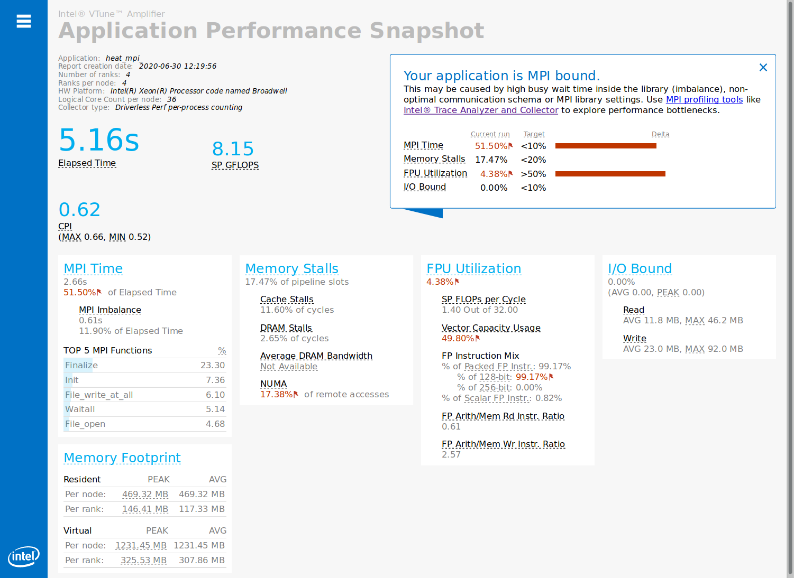
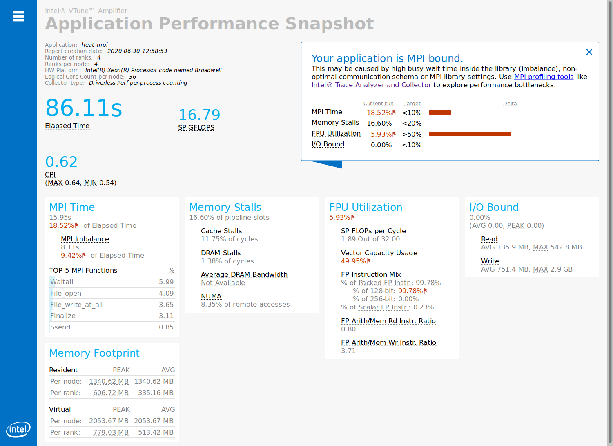
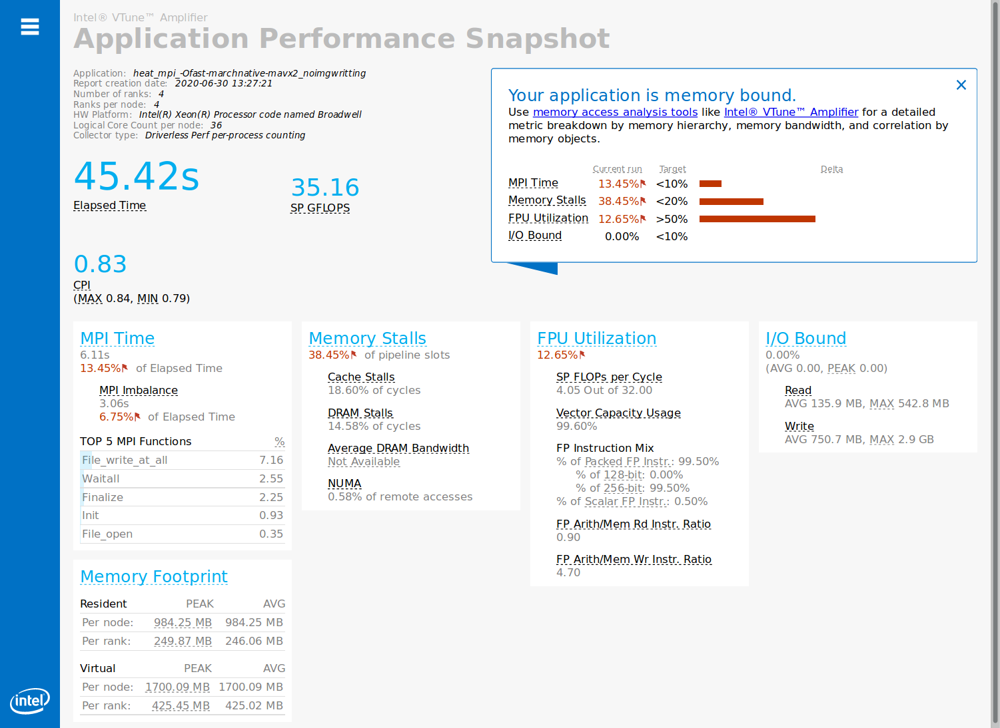
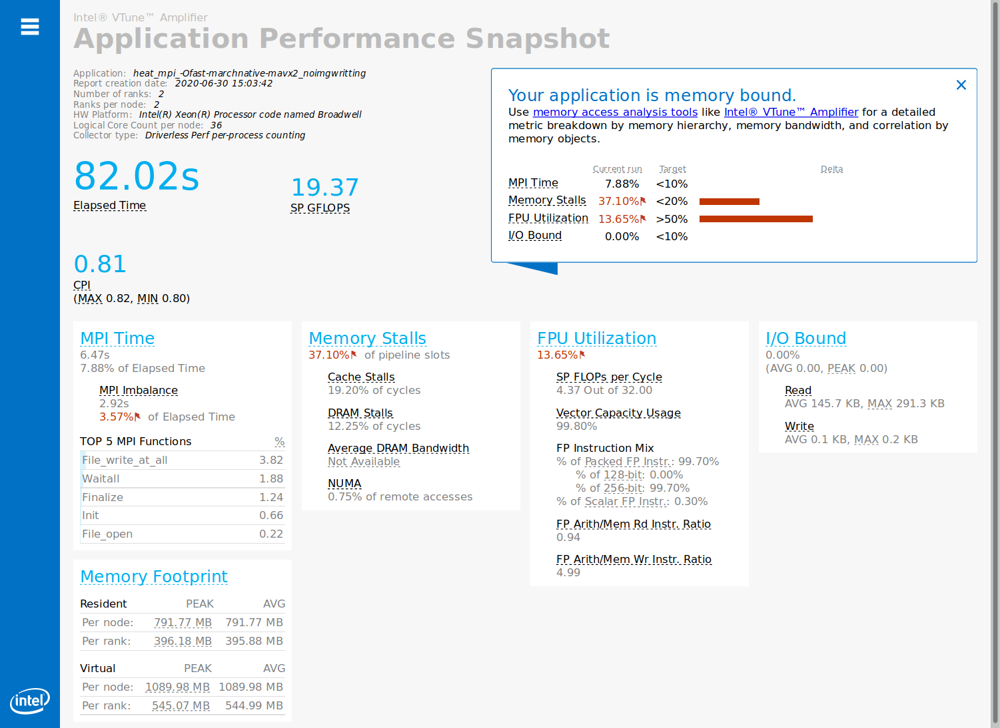

# P2.12_FinalProject
The source code used in this project was taken from https://repository.prace-ri.eu/git/CodeVault/training-material/parallel-programming/MPI/-/tree/master/heat-equation. It solves two dimensional heat equation with MPI parallelization. The code features non-blocking point-to-point communication, user defined datatypes, collective communication, and parallel I/O with MPI I/O.

The goal of this project is to use the Intel performance analysis tools to understand how to improve the source code.
Find out what are the bottlenecks

## 0. Setup
The experiments were done in galileo.

The source code requires the libpng library to be installed, this was done by:
```
tar -zxvf ../libpng-1.6.37.tar.gz 
cd libpng-1.6.37/
./configure --prefix=/galileo/home/userexternal/clauren1/opt/mylibs/libpng-1.6.37
make 
make install

```
To enable the compilation of the source code, the following modules had to be loaded:
```
module load intel/pe-xe-2018--binary
module load intelmpi/2018--binary
```
After adding to the Makefile the paths of the include and lib directories of libpng,the source code could finally be compiled :
```
clauren1@galileo(r050c06s08) ~/MHPC/P2.12_FinalProject/src(master) $ make
mpicc -O3 -Wall  -c core.c -o core.o -I /galileo/home/userexternal/clauren1/opt/mylibs/libpng-1.6.37/include 
mpicc -O3 -Wall  -c setup.c -o setup.o -I /galileo/home/userexternal/clauren1/opt/mylibs/libpng-1.6.37/include 
mpicc -O3 -Wall  -c utilities.c -o utilities.o -I /galileo/home/userexternal/clauren1/opt/mylibs/libpng-1.6.37/include 
mpicc -O3 -Wall  -c io.c -o io.o -I /galileo/home/userexternal/clauren1/opt/mylibs/libpng-1.6.37/include 
io.c: In function ‘read_field’:
io.c:140:16: warning: ‘full_data’ may be used uninitialized in this function [-Wmaybe-uninitialized]
         free_2d(full_data);
                ^
mpicc -O3 -Wall  -c main.c -o main.o -I /galileo/home/userexternal/clauren1/opt/mylibs/libpng-1.6.37/include 
mpicc -O3 -Wall  -c pngwriter.c -o pngwriter.o -I /galileo/home/userexternal/clauren1/opt/mylibs/libpng-1.6.37/include 
mpicc -O3 -Wall  core.o setup.o utilities.o io.o main.o pngwriter.o -o heat_mpi  -lpng -lm -L /galileo/home/userexternal/clauren1/opt/mylibs/libpng-1.6.37/lib

```
To run the program, it needs to know at run time what is the path to the libpng libraries, this is done by command:
```
export LD_LIBRARY_PATH=$LD_LIBRARY_PATH:/galileo/home/userexternal/clauren1/opt/mylibs/libpng-1.6.37/lib
```
And the program can then be run with:
```
mpirun -np 4 ./heat_mpi
```


## 1. Application Performance Snapshot 

This tool is part of the Intel VTune Amplifier suite.

On the CINECA galileo cluster it can be accessed after loading the vtune module:
```
module load vtune/2018
```

#### 1.a) Code default version and compilation
As a first step, the default configuration of the program using **2000 rows and columns and 500 timesteps** was evaluated with **APS** using **4 MPI processes**. The Makefile uses the compilation flags `-O3` which sets up level-3 vectorialization and `-Wall` enabling compiler Warning messages. The results of this analysis can be found in the folder `aps_np4_rowscols2000`:



The main diagnostic indicates that the program is MPI bounded. 

Before looking any further, given the fact that 49.97% of the time is spent in the MPI operations, and given the high costs of the MPI Init and MPI Finalize functions, let's try to increase the size of the problem, given that running MPI parallel application makes sense only if the problem size is large enough, otherwise the overhead caused by the MPI instructions is too high respect to the computational time.

#### 1.b) Increasing the problem size 
The domain size and time steps were increased using **6000 rows and columns** and **2000 timesteps**, keeping the same number of **MPI processes : 4** and the same compilation flags as the default source code.

The results of the APS analysis are in folder `aps_np4_rowscols6000_NT2000_COPT`.



The costs of the MPI initialize and finalize functions are now much more reasonable, and more time is now spent in the `Waitall` MPI instruction.

The MPI Time (17.62% of Elapsed Time) remains high respect to the Target : (<10%). This seems to be due to the MPI imbalance (8.69%), reducing this imbalance the target of 10% might become reachable. In facts, the TOP 5 MPI functions indicate `Waitall`, `File_open` and `File_write_at_all` as the most time demanding MPI instructions.

Looking at the source code, we identified the main iterative loop on the number of timesteps : 

```c
for (iter = iter0; iter < iter0 + nsteps; iter++) {
        exchange_init(&previous, &parallelization);
        evolve_interior(&current, &previous, a, dt);
        exchange_finalize(&parallelization);
        evolve_edges(&current, &previous, a, dt);
        if (iter % image_interval == 0) {
            write_field(&current, iter, &parallelization);
        }
       /* write a checkpoint now and then for easy restarting */
        if (iter % restart_interval == 0) {
            write_restart(&current, &parallelization, iter);
        }
        /* Swap current field so that it will be used
            as previous for next iteration step */
        swap_fields(&current, &previous);
    }
```

The `Waitall` happens during the `exchange_finalize` function. Some MPI process might be slower than the others, we can exclude reasons linked to domain partitioning, given that the physics is resolved on every element of the computational grid, and given that the computational domain is squared and was divided in 2x2 blocks, so that all the rank should be doing the same number of exchanges on the borders of the blocks.  As a first guess, the overheads that were observed  could be due to the writing of the png file that is done by the master process during the call of the `write_field` function. 

#### 1.c) png output as an origin of the MPI bounding

To asses if the output of the png files could or not be the origin of the MPI imbalance that makes the code MPI bound, let's run the program on the same configuration, but removing the output of the png files. The results of this analysis are in the folder `aps_results_np4_rowscols6000_NT2000_COPTnoimgwritting` and the APS summary is the following:


Removing the writting of the png files, the target of max 10% of MPI time is reached, we are now at 6.44% which is quite satisfying. The first guess is then confirmed, the origin of the MPI bound is the writting of the png files that is made in serial, after collecting the fields on the master process. 

To cope with this, there could be different solutions:

- we search for another library allowing to write png files in a distributed way, if such a library exists.
- or an additional process could be dedicated to the writting of the png files, it would gather the fields from the computing processes and handle the image writting while the other nodes compute the next set of iterations.
- another solution could be to write in a distributed way a binary file (such as the restart file) containing the desired fields and produce the graphics offline, as a post-treatment done by another program.

#### 1.d) Improve FPU Utilization with compilation flags

Once removed the origin of the MPI bound, APS identifies as the main remaining problem the memory bound issue, and suggests to use Intel VTune Amplifier to analyse it. Before to do so, we can notice that another critical aspect identified by APS is the PFU Utilization : 7.15% while the target is >50%.

In the FPU Utilization box, APS indicates that only 50% of the floating point vectorization capacity is done, and that all the floating points instructions are packed in 128bits, and gives the following additional informations:

> *A significant fraction of floating point arithmetic vector instructions* 
> *executed with partial vector load. A possible reason is compilation with*
> *a legacy instruction set. Check the compiler options. Another possible* 
> *reason is compiler code generation specifics. Use [Intel® Advisor](https://software.intel.com/en-us/intel-advisor-xe) to learn more.*

The first thing to do is to add the compilation flags allowing the compiler to take into consideration the specific CPU architecture on which we are running and compiling in order to take advantage of the 256-bits vectorization capacities of avx2.

To do so, the flags `-march=native` and `-mavx2` were added into the Makefile; the results of the APS analysis for this new run can be found in folder `aps_results_np4_rowscols6000_NT2000_COPT-marchnative-mavx2_noimgwritting` and the APS summary is the following:


As we can notice the 256bits vectorization capacity is still used only partially, and the FPU utilization did not increase much.  As an additional step, we choosed to add as well the `-Ofast` flag, which enables `-ffast-math`, which in turn enables `-fno-math-errno`, `-funsafe-math-optimizations`, `-ffinite-math-only`, `-fno-rounding-math`, `-fno-signaling-nans` and `-fcx-limited-range`.  

The results of the APS analysis for this new run can be found in folder `aps_results_np4_rowscols6000_NT2000_COPT-Ofast-marchnative-mavx2_noimgwritting` and the APS summary is the following:



As we can see, with this configuration the full 256bits vectorization capacity is used, but the FPU Utilization remains low.

Some other flags could bring additional benefit, like `-fno-signed-zeros` and  `-fno-trapping-math` , but if they were to be used the results of the program should be checked carefully.


In the actual state, the main reason for the high MPI time and low FPU utilization is for sure at least partially linked to the problem size, as using 4 MPI processes for a quite small computational domain and such a short simulation time has a cost that his quite important respect to the actual computational time. In facts, as shown by the next APS summary (corresponding to the results in folder `aps_results_np2_rowscols6000_NT2000_COPT-Ofast-marchnative-mavx2_noimgwritting`), reducing the number of MPI processes to only 2 processes lowers the cost of the restart file (`File_write_at_all` MPI function) given that the computational time increases. Consequently the FPU Utilization increases, but only because twice more computational work has been done while the main MPI cost (writting the restart file) remained unchanged.




To get more insights on how to improve the floating point unit instructions per second, and the memory bound issue, it is time to change tool and see which indications we could get with VTune Amplifier.


## 2. Intel VTune

## 3. Intel Advisor

## 4. Optimize the code
