# P2.12_FinalProject

The source code used in this project was taken from https://repository.prace-ri.eu/git/CodeVault/training-material/parallel-programming/MPI/-/tree/master/heat-equation. It solves two dimensional heat equation with MPI parallelization. The code features non-blocking point-to-point communication, user defined datatypes, collective communication, and parallel I/O with MPI I/O.

The goal of this project is to use the Intel performance analysis tools to understand how to improve the source code and find out what are the bottlenecks.

The Intel tool suite for performance analysis includes the following softwares:
- **Intel Application Performance Snapshot (APS)**: *Take a quick look at your application's performance to see if it is well optimized for modern hardware*
  -  *MPI parallelism*
  -  *OpenMP parallelism*
  -  *Memory access*
  -  *FPU Utilization*
  -  *I/O efficiency*


- **Intel Advisor**: *Design and optimize high-performing code for modern computer architectures. Effectively use more cores, vectorization, memory, and heterogeneous processing..*
- **Intel VTune Profiler** or **VTune Amplifier** : *Locate performance bottlenecks fast. Advanced sampling and profiling techniques quickly analyze your code, isolate issues, and deliver insights for optimizing performance on modern processors.*
- **Intel Trace Analyzer and Collector (ITAC)** : *a graphical tool for understanding MPI application behavior, quickly finding bottlenecks, improving correctness, and achieving high performance for parallel cluster applications based on Intel architecture.*

---
## Table Of Contents
   * [P2.12_FinalProject](#p212_finalproject)
       * [0. Setup](#0-setup)
           * [0.a) libpng](#0a-libpng)
           * [0.b) Intel libraries](#0b-intel-libraries)
           * [0.c) Intel tool suite](#0c-intel-tool-suite)
           * [0.d) Running the program with MPI](#0d-running-the-program-with-mpi)
       * [0.1 Setup on Intel® DevCloud](#01-setup-on-intel-devcloud)
       * [1. Application Performance Snapshot](#1-application-performance-snapshot)
            * [1.a) Code default version and compilation](#1a-code-default-version-and-compilation)
            * [1.b) Increasing the problem size](#1b-increasing-the-problem-size)
            * [1.c) png output as an origin of the MPI bounding](#1c-png-output-as-an-origin-of-the-mpi-bounding)
            * [1.d) Improve FPU Utilization with compilation flags](#1d-improve-fpu-utilization-with-compilation-flags)
            * [1.1 Application Performance Snapshot on Intel® DevCloud](#11-application-performance-snapshot-on-intel-devcloud)
                * [1.1.a) Code default version and compilation](#11a-code-default-version-and-compilation)
      * [2. Intel Advisor](#2-intel-advisor)
         * [2.1 Intel Advisor on Intel® DevCloud](#21-intel-advisor-on-intel-devcloud)
      * [3. Intel VTune Profiler](#3-intel-vtune-profiler)
         * [3.1 Intel VTune Profiler on Intel® DevCloud](#31-intel-vtune-profiler-on-intel-devcloud)

## 0. Setup
The experiments were done on the **Galileo** cluster of the **CINECA**.

`sourceme.sh` is a file provided in the main folder of this repository which can be sourced (`source sourceme.sh`) in order to run automatically the setup described in this section.

##### 0.a) libpng

The source code requires the libpng library to be installed, this was done by:
```
tar -zxvf ../libpng-1.6.37.tar.gz 
cd libpng-1.6.37/
./configure --prefix=/galileo/home/userexternal/clauren1/opt/mylibs/libpng-1.6.37
make 
make install
```
Then, in order to run, the program needs to know at run time what is the path to the libpng libraries, this is done by command:

```
export LD_LIBRARY_PATH=$LD_LIBRARY_PATH:/galileo/home/userexternal/clauren1/opt/mylibs/libpng-1.6.37/lib
```

##### 0.b) Intel libraries

To enable the compilation of the source code, the following modules had to be loaded:

```
module load intel/pe-xe-2018--binary
module load intelmpi/2018--binary
```
After adding to the Makefile the paths of the include and lib directories of libpng,the source code could finally be compiled :
```
clauren1@galileo(r050c06s08) ~/MHPC/P2.12_FinalProject/src(master) $ make
mpicc -O3 -Wall  -c core.c -o core.o -I /galileo/home/userexternal/clauren1/opt/mylibs/libpng-1.6.37/include 
mpicc -O3 -Wall  -c setup.c -o setup.o -I /galileo/home/userexternal/clauren1/opt/mylibs/libpng-1.6.37/include 
mpicc -O3 -Wall  -c utilities.c -o utilities.o -I /galileo/home/userexternal/clauren1/opt/mylibs/libpng-1.6.37/include 
mpicc -O3 -Wall  -c io.c -o io.o -I /galileo/home/userexternal/clauren1/opt/mylibs/libpng-1.6.37/include 
io.c: In function ‘read_field’:
io.c:140:16: warning: ‘full_data’ may be used uninitialized in this function [-Wmaybe-uninitialized]
         free_2d(full_data);
                ^
mpicc -O3 -Wall  -c main.c -o main.o -I /galileo/home/userexternal/clauren1/opt/mylibs/libpng-1.6.37/include 
mpicc -O3 -Wall  -c pngwriter.c -o pngwriter.o -I /galileo/home/userexternal/clauren1/opt/mylibs/libpng-1.6.37/include 
mpicc -O3 -Wall  core.o setup.o utilities.o io.o main.o pngwriter.o -o heat_mpi  -lpng -lm -L /galileo/home/userexternal/clauren1/opt/mylibs/libpng-1.6.37/lib

```
##### 0.c) Intel tool suite

On the CINECA- Galileo cluster the various Intel Performance analysis tools can be accessed after loading the vtune module:

```
module load vtune/2018
```

##### 0.d) Running the program with MPI

And the program can then be run with:

```
mpirun -np 4 ./heat_mpi
```

### 0.1 Setup on Intel&reg; DevCloud
This sections explains the setup done on Intel DevCloud cluster.

As explained in previous section we install the `libpng` on DevCloud on our home directory. Although we can export the `libpng` path to `LD_LIBRARY_PATH`, here we modify the Makefile and add the link time flag, `LDFLAGS=-L/home/u44658/lib/` and add the includes to compile time with `INCS=-I/home/u44658/include/`, and we change the compiler from gnu `mpicc` to intel `mpiicc`.
All other tools come preloaded on DevCloud, though we have to source the proper environmental variables, for Applications Performance Snapshot, we do `source $(locate apsvars.sh)`, and for Intel Advisor, we do `source $(locate advixe-vars.sh)`.
We note that DevCloud only allows 1 nodes and 2 cores per user, so we enter a compute node interactively, like this: 
```
qsub -l nodes=1:batch:ppn=2 -d . -I
```
Also we note that DevCloud platform is **Skylake**, while Galileo is **Broadwell**.


## 1. Application Performance Snapshot 

This tool is part of the Intel VTune Amplifier suite.

#### 1.a) Code default version and compilation
As a first step, the default configuration of the program using **2000 rows and columns and 500 timesteps** was evaluated with **APS** using **4 MPI processes**. The Makefile uses the compilation flags `-O3` which sets up level-3 vectorialization and `-Wall` enabling compiler Warning messages. The results of this analysis can be found in the folder `aps_np4_rowscols2000_NT500_COPT`:

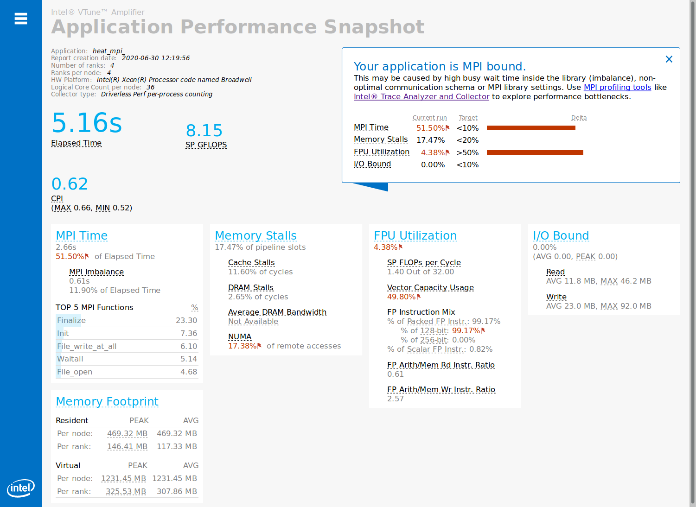

The main diagnostic indicates that the program is MPI bounded. 

Before looking any further, given the fact that 49.97% of the time is spent in the MPI operations, and given the high costs of the MPI Init and MPI Finalize functions, let's try to increase the size of the problem, given that running MPI parallel application makes sense only if the problem size is large enough, otherwise the overhead caused by the MPI instructions is too high respect to the computational time.

#### 1.b) Increasing the problem size 
The domain size and time steps were increased using **6000 rows and columns** and **2000 timesteps**, keeping the same number of **MPI processes : 4** and the same compilation flags as the default source code.

The results of the APS analysis are in folder `aps_np4_rowscols6000_NT2000_COPT`.


The costs of the MPI initialize and finalize functions are now much more reasonable, and more time is now spent in the `Waitall` MPI instruction.

The MPI Time (17.62% of Elapsed Time) remains high respect to the Target : (<10%). This seems to be due to the MPI imbalance (8.69%), reducing this imbalance the target of 10% might become reachable. In facts, the TOP 5 MPI functions indicate `Waitall`, `File_open` and `File_write_at_all` as the most time demanding MPI instructions.

Looking at the source code, we identified the main iterative loop on the number of timesteps : 

```c
for (iter = iter0; iter < iter0 + nsteps; iter++) {
        exchange_init(&previous, &parallelization);
        evolve_interior(&current, &previous, a, dt);
        exchange_finalize(&parallelization);
        evolve_edges(&current, &previous, a, dt);
        if (iter % image_interval == 0) {
            write_field(&current, iter, &parallelization);
        }
       /* write a checkpoint now and then for easy restarting */
        if (iter % restart_interval == 0) {
            write_restart(&current, &parallelization, iter);
        }
        /* Swap current field so that it will be used
            as previous for next iteration step */
        swap_fields(&current, &previous);
    }
```

The `Waitall` happens during the `exchange_finalize` function. Some MPI process might be slower than the others, we can exclude reasons linked to domain partitioning, given that the physics is resolved on every element of the computational grid, and given that the computational domain is squared and was divided in 2x2 blocks, so that all the rank should be doing the same number of exchanges on the borders of the blocks.  As a first guess, the overheads that were observed  could be due to the writing of the png file that is done by the master process during the call of the `write_field` function. 

#### 1.c) png output as an origin of the MPI bounding

To asses if the output of the png files could or not be the origin of the MPI imbalance that makes the code MPI bound, let's run the program on the same configuration, but removing the output of the png files. The results of this analysis are in the folder `aps_results_np4_rowscols6000_NT2000_COPTnoimgwritting` and the APS summary is the following:

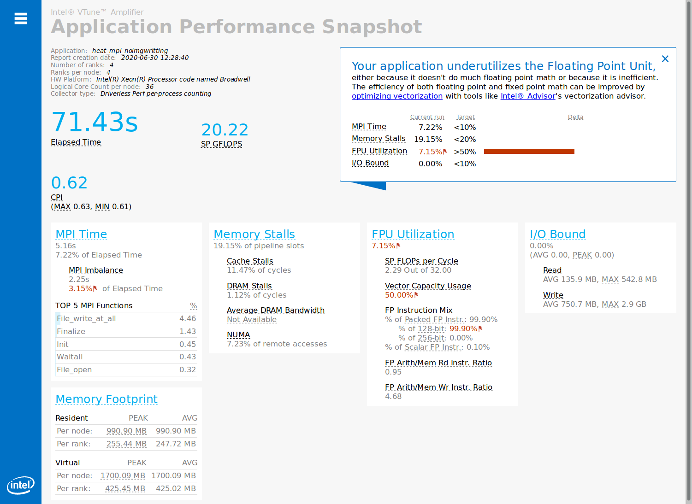

Removing the writting of the png files, the target of max 10% of MPI time is reached, we are now at 6.44% which is quite satisfying. The first guess is then confirmed, the origin of the MPI bound is the writting of the png files that is made in serial, after collecting the fields on the master process. 

To cope with this, there could be different solutions:

- we search for another library allowing to write png files in a distributed way, if such a library exists.
- or an additional process could be dedicated to the writting of the png files, it would gather the fields from the computing processes and handle the image writting while the other nodes compute the next set of iterations.
- another solution could be to write in a distributed way a binary file (such as the restart file) containing the desired fields and produce the graphics offline, as a post-treatment done by another program.

#### 1.d) Improve FPU Utilization with compilation flags

Once removed the origin of the MPI bound, APS identifies that the main remaining problem is the underutilization of the Floating Point Unit : 7.15% while the target is >50%.

In the FPU Utilization box, APS indicates that only 50% of the floating point vectorization capacity is done, and that all the floating points instructions are packed in 128bits, and gives the following additional informations:

> *A significant fraction of floating point arithmetic vector instructions* 
> *executed with partial vector load. A possible reason is compilation with*
> *a legacy instruction set. Check the compiler options. Another possible* 
> *reason is compiler code generation specifics. Use [Intel® Advisor](https://software.intel.com/en-us/intel-advisor-xe) to learn more.*

The first thing to do is to add the compilation flags allowing the compiler to take into consideration the specific CPU architecture on which we are running and compiling in order to take advantage of the 256-bits vectorization capacities of avx2.

To do so, the flags `-march=native` and `-mavx2` were added into the Makefile; the results of the APS analysis for this new run can be found in folder `aps_results_np4_rowscols6000_NT2000_COPT-marchnative-mavx2_noimgwritting` and the APS summary is the following:

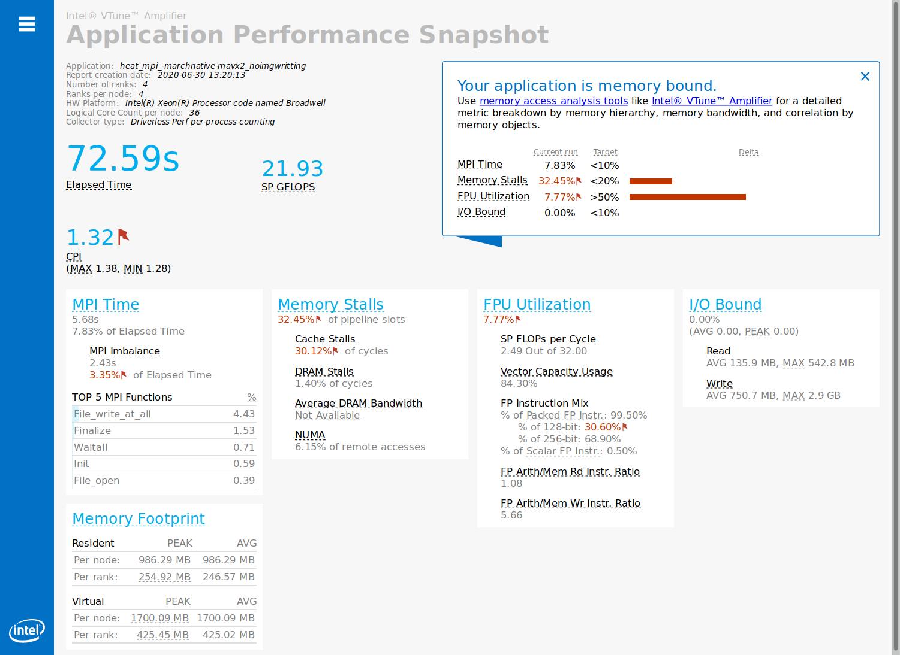

As we can notice the 256bits vectorization capacity is still used only partially, and the FPU utilization did not increase much.  As an additional step, we choosed to add as well the `-Ofast` flag, which enables `-ffast-math`, which in turn enables `-fno-math-errno`, `-funsafe-math-optimizations`, `-ffinite-math-only`, `-fno-rounding-math`, `-fno-signaling-nans` and `-fcx-limited-range`.  

The results of the APS analysis for this new run can be found in folder `aps_results_np4_rowscols6000_NT2000_COPT-Ofast-marchnative-mavx2_noimgwritting` and the APS summary is the following:

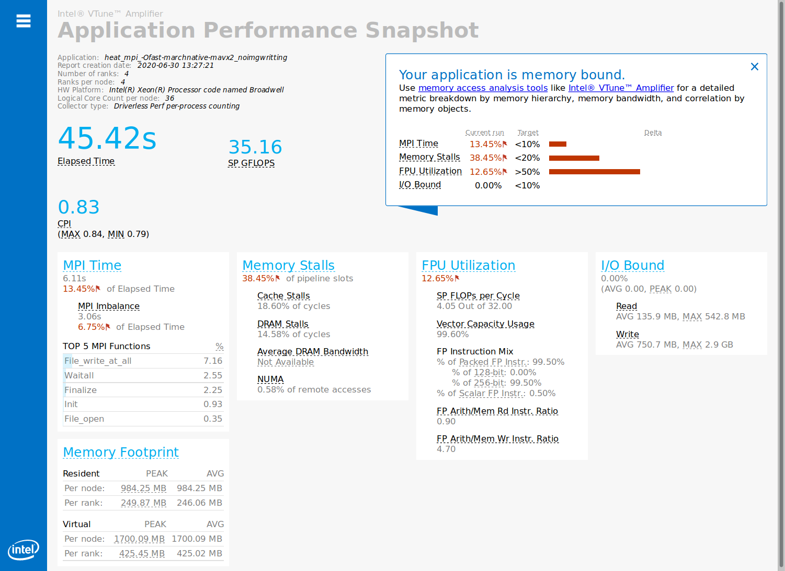

As we can see, with this configuration the full 256bits vectorization capacity is used, but the FPU Utilization remains low.

Some other flags could bring additional benefit, like `-fno-signed-zeros` and  `-fno-trapping-math` , but if they were to be used the results of the program should be checked carefully.

In the actual state, the main reason for the high MPI time and low FPU utilization is for sure at least partially linked to the problem size, as using 4 MPI processes for a quite small computational domain and such a short simulation time has a cost that his quite important respect to the actual computational time. In facts, as shown by the next APS summary (corresponding to the results in folder `aps_results_np2_rowscols6000_NT2000_COPT-Ofast-marchnative-mavx2_noimgwritting`), reducing the number of MPI processes to only 2 processes lowers the cost of the restart file (`File_write_at_all` MPI function) given that the computational time increases. Consequently the FPU Utilization increases, but only because twice more computational work has been done while the main MPI cost (writting the restart file) remained unchanged.

The FPU Utilization remains anyway much too low, the Application Performance Snapshots suggests to use **Intel Advisor** to get more insights on the origin of the problem.

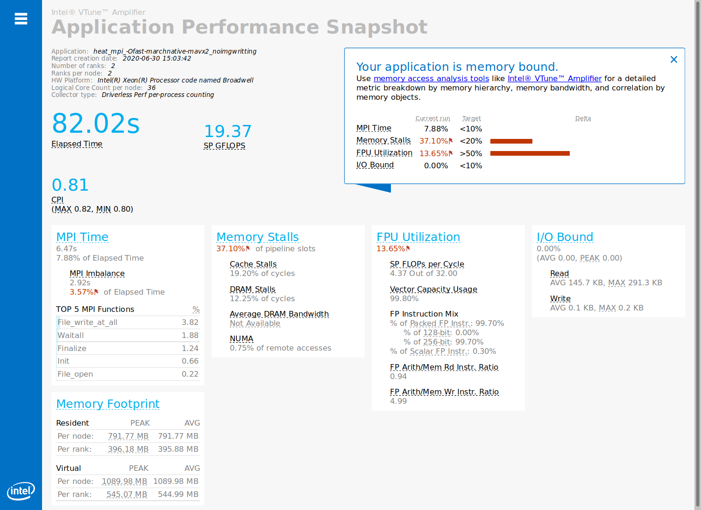

At this point, APS identifies that the main remaining problem is the memory bound issue, and suggests to use the **Memory Access Analysis** tool of **Intel VTune Profiler** to analyse it. 

To get more insights on how to improve the floating point unit instructions per second, and the memory bound issue, it is time to change tool and see which indications we could get using  **Intel Advisor** and **Intel VTune Profiler**.


### 1.1 Application Performance Snapshot on Intel&reg; DevCloud

For comaprison reasons, here we put also the results from Intel DevClous.
To get the analysis results with APS, first we run `aps` through `mpirun` and then generate the html reports.
```
mpirun -np <NP> aps ./heat_mpi
aps --report=<results_directory>
```

#### 1.1.a) Code default version and compilation

We use the same configurations as *section 1.a*, noting that we can only run at most with **2 MPI processes**. Here we can see the results with 2 mpi processes.

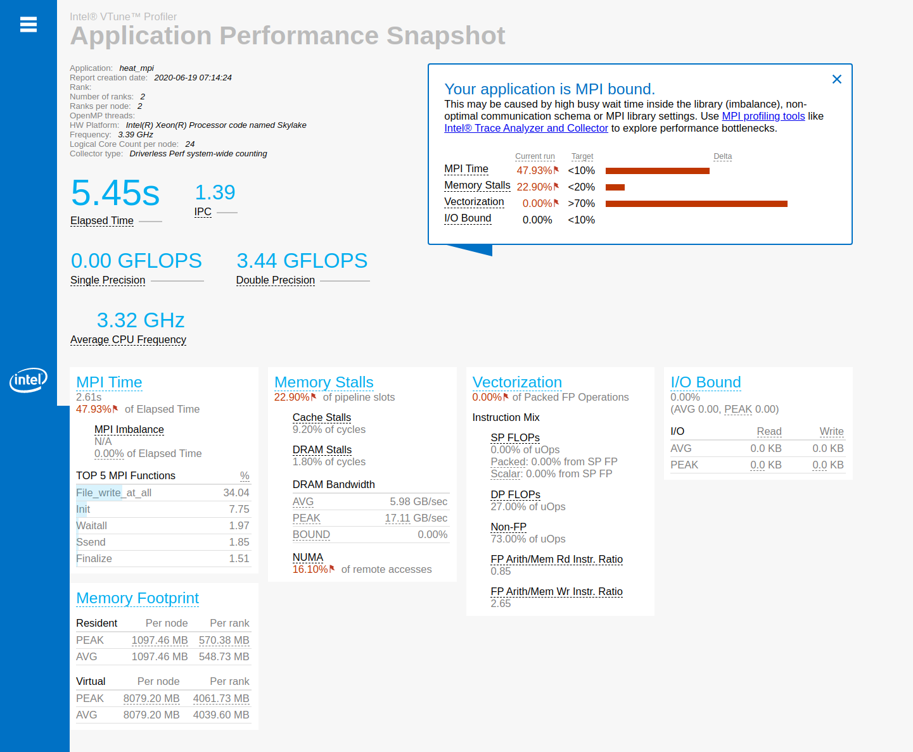

Ignoring the differences coming from the fact that the two microarchitectures are differnet, we can also see that MPI time occupies around 47% of the total time, and hence the application is MPI bound at this stage. As explained in *section 1.b* this issue can be rectified by increasing the problem size, as with small problem size the overhead of MPI initializaton and communication cost is large compared to compute time, as can be seen from rank-to-rank communication matrix below, also this shows that there is a data transfer imbalance between two ranks:


To generate the figure above we use: 
```
aps-report -x --format=html <result_name>
``` 
Furthermore we can remove writing png files and reduce the MPI time even more, as explained in *section 1.c*.

## 

## 2. Intel Advisor

To test Intel Advisor, the original source code version (writing the `png` files) was restored, the `miicc` compiler was used with the optimization flags `-Ofast -march=core-avx2`  adding as well the flags `-qopt-report=5 -qopt-report-phase=all -g` so that compilation produces additional informations allowing Intel Advisor to get more insights on the source code.

The program run and its analysis were performed using the following commands:

```bash
MPIranks=2
Nrow_cols=6000
Nt=2000
Version='origin'
CASE=np${MPIranks}_rowscols${Nrow_cols}_NT${Nt}_${Version}
for what in survey tripcounts map dependencies ; do
    mpirun -np 2 advixe-cl -collect ${what} -no-auto-finalize -project-dir ./adv_${CASE}  --search-dir src:r=../src/${Version}  ../src/${Version}/heat_mpi
    rm HEAT_RESTART.dat
    rm heat*.png
done
advixe-cl --snapshot --project-dir ./adv_${CASE} --pack --cache-sources --cache-binaries   --search-dir src:r=../src/${Version}/ -- ./adv_${CASE}
```

This allowed to obtain the following analysis for the original source code:

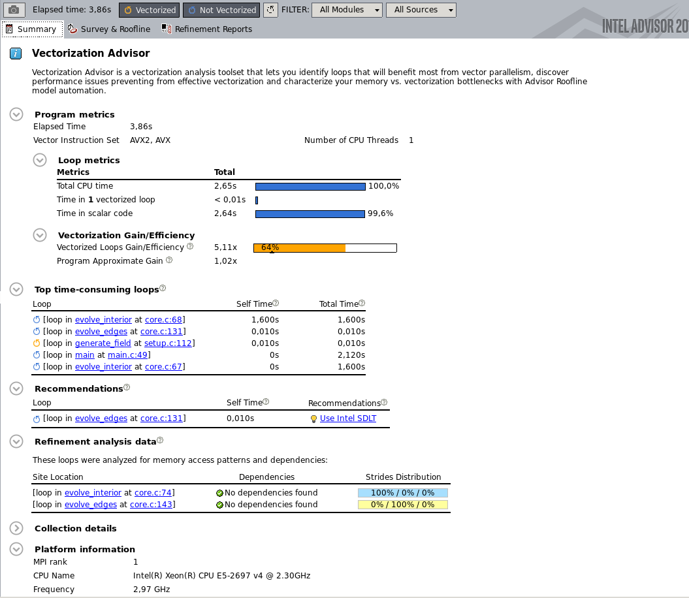

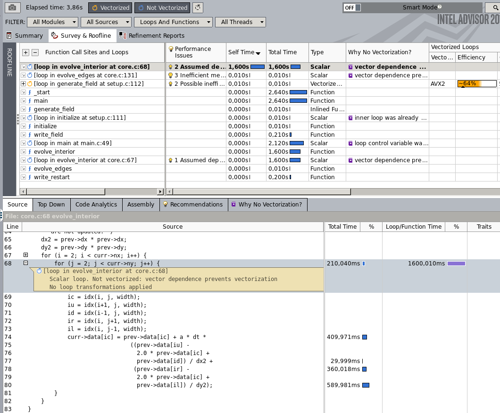

Intel Advisor identifies that the `evolve_interior` and `evolve_edges` functions contain a loop that is not vectorized because the compiler assumed that there might be data dependency.

In facts, `curr` and `prev` are two pointers towards objects of the same type passed by reference to these functions, so that the compiler has no guaranty that the pointers point to different memory addresses. 

We know that they are actually different, as two distinct memory areas are allocated in the `main.c`. Consequently, we can modify the headers of these functions (in `heat.c` and `core.c`) using the `restrict` keyword that guaranties to the compiler that such pointers does not have any alias :

```c
void evolve_interior(field *__restrict__ curr, field *__restrict__ prev, double a, double dt);
void evolve_edges(field *__restrict__ curr, field *__restrict__ prev, double a, double dt);
```

With this modification done, the next screen-shot of Intel Advisor indicates that the loops were vectorized using avx2 with a 100% of efficiency, and in facts the time to run `evolve_interior` is reduced almost by a factor 2.

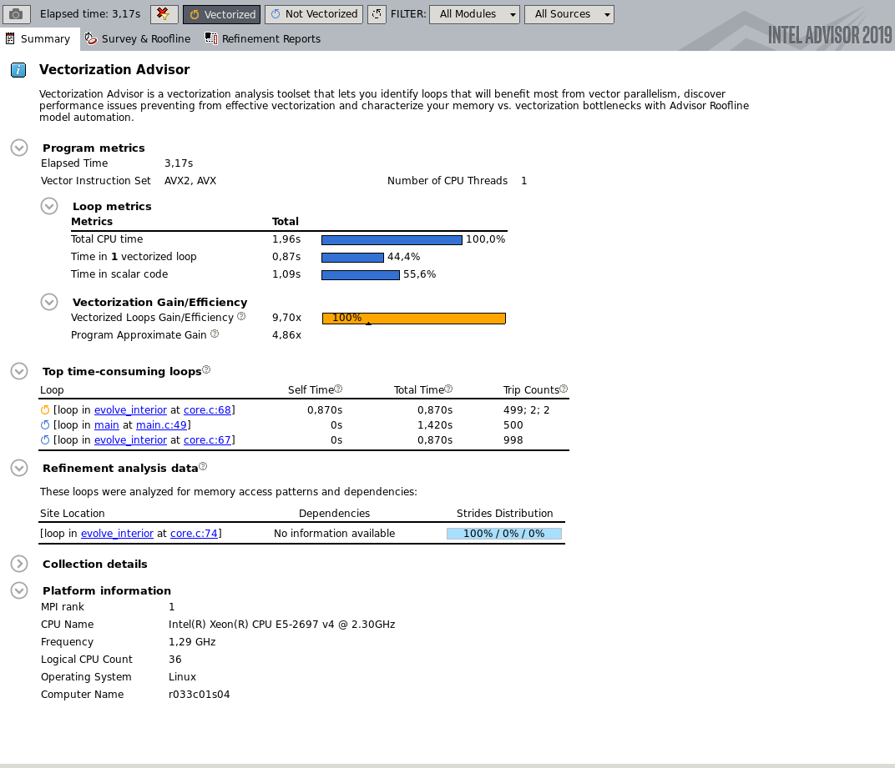

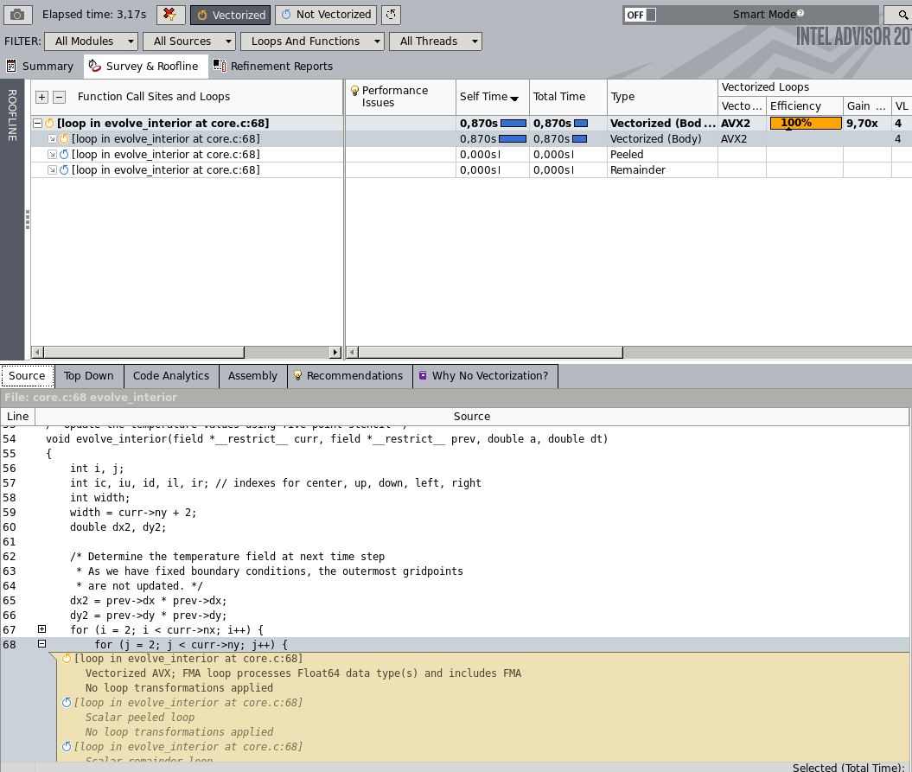

As expected, the other main time demanding component is `write_field` which is responsible of the `png` outputs.

### 2.1 Intel Advisor on Intel&reg; DevCloud

To collect `survey` results with Intel Advisor with 1 MPI process, we do:

```
mpirun -n 1 -gtool "advixe-cl -collect survey -no-auto-finalize -project-dir ./adv_np1:0" ./heat_mpi
```

and we also do the same for `tripcounts`, `map`, and`dependencies`, after that we pack the results and view the cumultive result in `advisor-gui`:

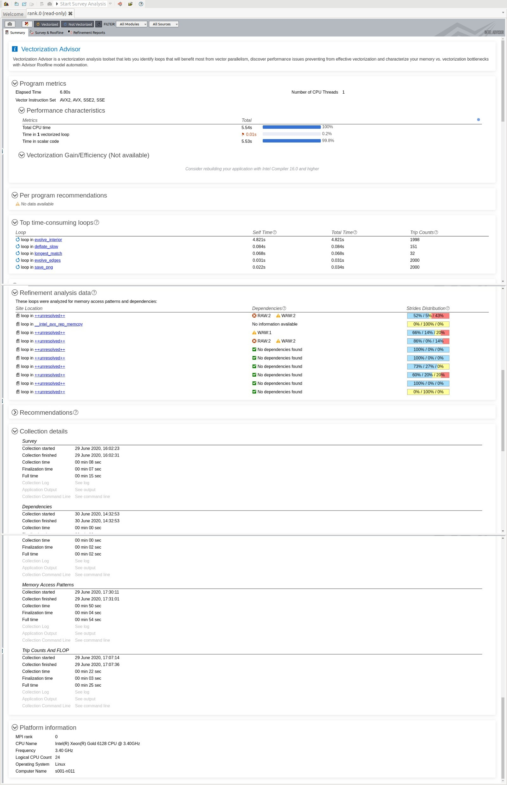

Also below we can see the roofline chart:

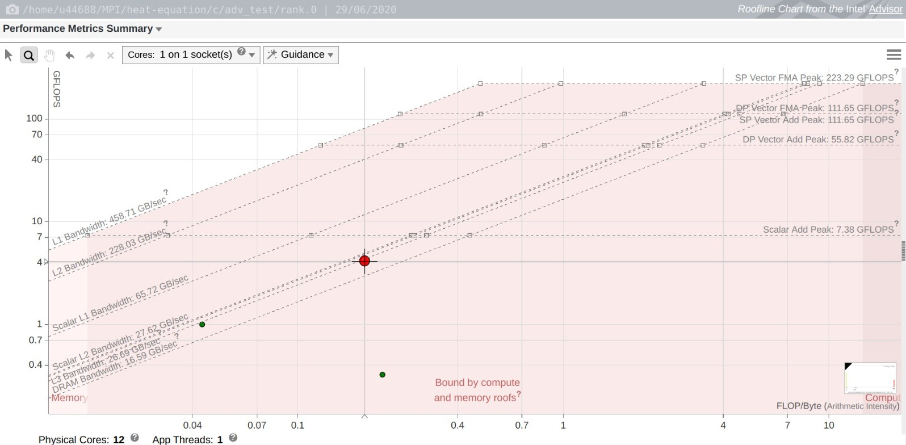

##

## 3. Intel VTune Profiler

Intel VTune Amplifier Performance Profiler was run for the `origin` and `restrict` versions of the source code, using the following commands :

```bash
MPIranks=2
Nrow_cols=4000
Nt=2000
HOST=$(hostname)
for collect in hpc-performance concurrency hotspots memory-consumption advanced-hotspots locksandwaits ; do
 for Version in origin restrict ; do
  CASE=np${MPIranks}_RC${Nrow_cols}_NT${Nt}_${Version}_collect-${collect}
  rm -r $CASE.$HOST
  mpiexec -np ${MPIranks}  amplxe-cl -collect ${collect}  -result-dir $CASE ../../src/$Version/heat_mpi $Nrow_cols $Nrow_cols $Nt
  amplxe-cl   -report summary -report-knob show-issues=false -format=text -r $CASE.$HOST  > $CASE.$HOST.summary.out
  rm HEAT_RESTART.dat
  rm heat*.png
 done
done
```

The Analysis run by VTune Performance Profiler shows for the `origin` version of the source code that using 2 MPI procs, in average the number of active CPUs is 1. 

Among the time to solution: 117 seconds, the time where no CPU is active is very important : 30 seconds, that might correspond to the time spent waiting for memory access. And the time were both CPUs are active is actually very small: less than 20 seconds. 

This analysis confirms what has been previously identified : the png writting and consequent MPI wait, coupled with the  memory bounds make the MPI balancing very unefficient.

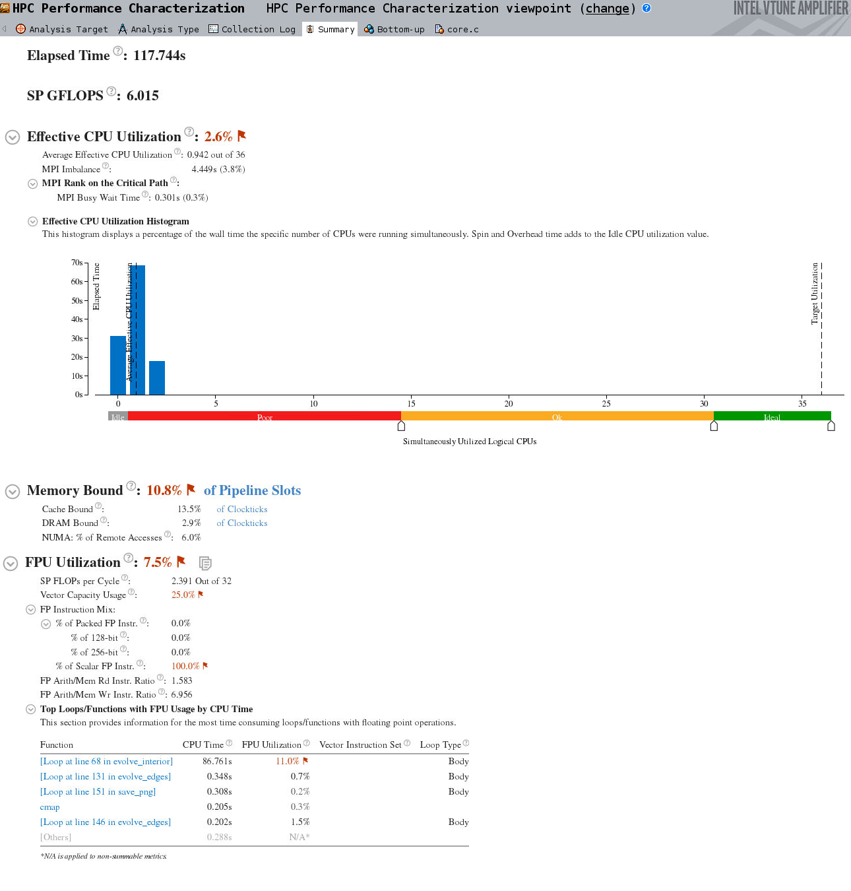
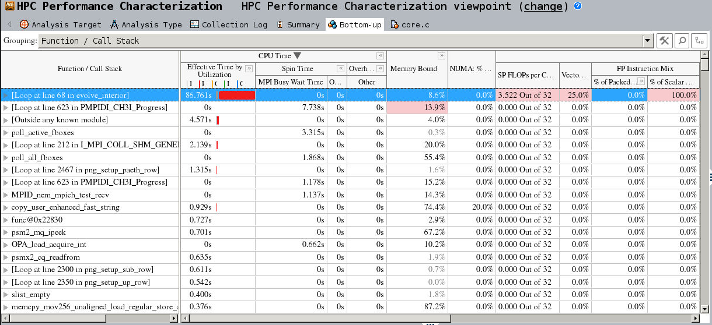

We can see that using the `restrict` version the code is slightly more efficient, the loop in `evolve_interior` pass from 86 seconds to 69 seconds, however the improvement is smaller than what was observed using Advisor. We can see that for the `restrict` version this loop is actually 100% vectorized (avx2 256pack), against 100% scalar in the `origin` version and the global FPU Utilization slightly increased from 7% to 10%. 

There is an improvement in the time needed to do this critical loop but it remains small, because vectorizing this loop makes it become completely memory bounded, in facts the global memory bound of the code that pass from 10% in the `origin` version to 40% in the `restrict` version.

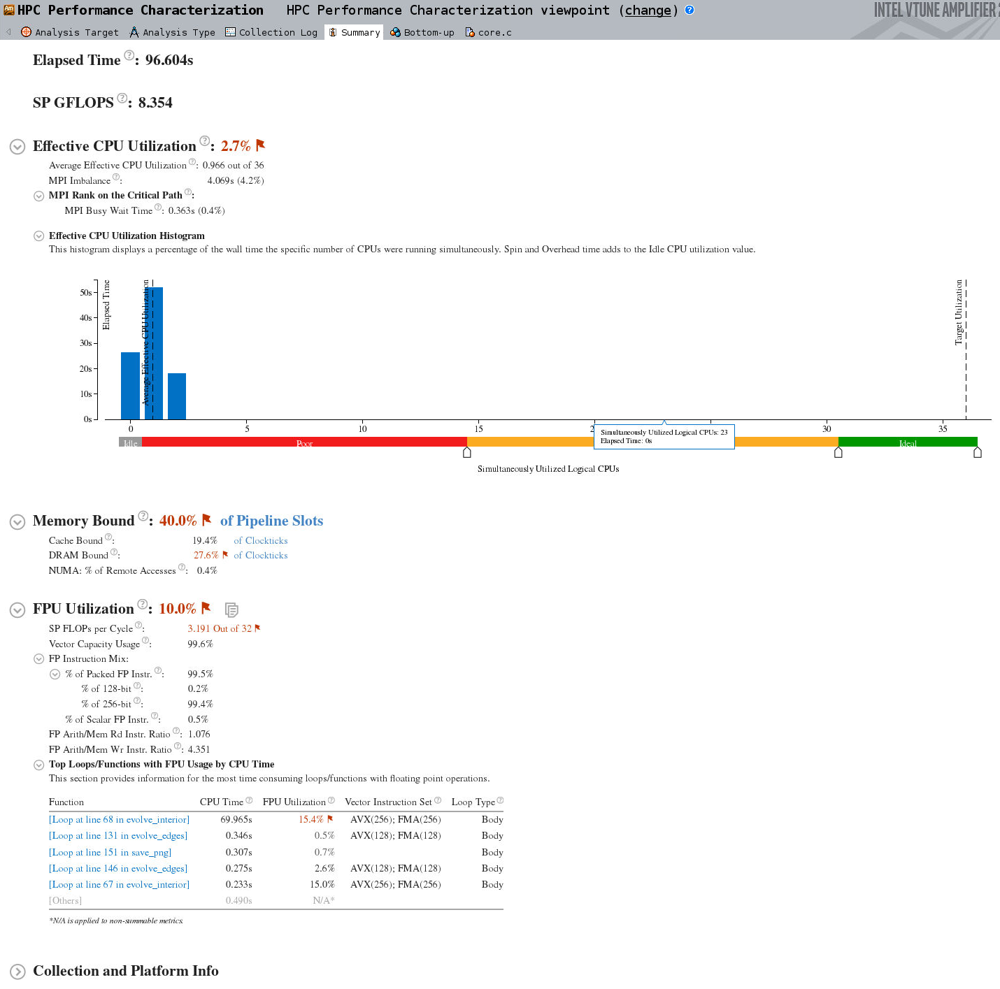

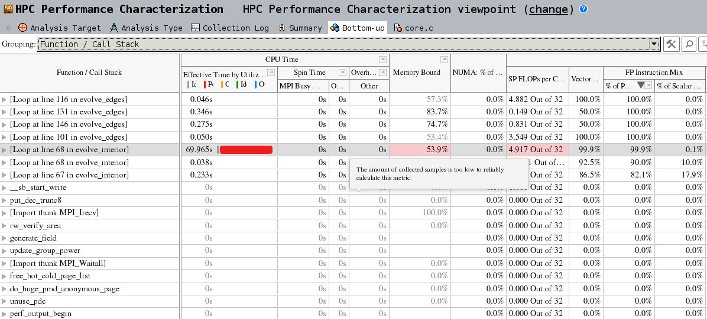

### 3.1 Intel VTune Profiler on Intel&reg; DevCloud

To generate the a `summary` report with vtune with 2 MPI processes, we do:

```
vtune -report summary -format=html -report-knob show-issues=false -r vtune_test.s001-n007/ > vtune_summary_np2.html
```

We can see the results below:

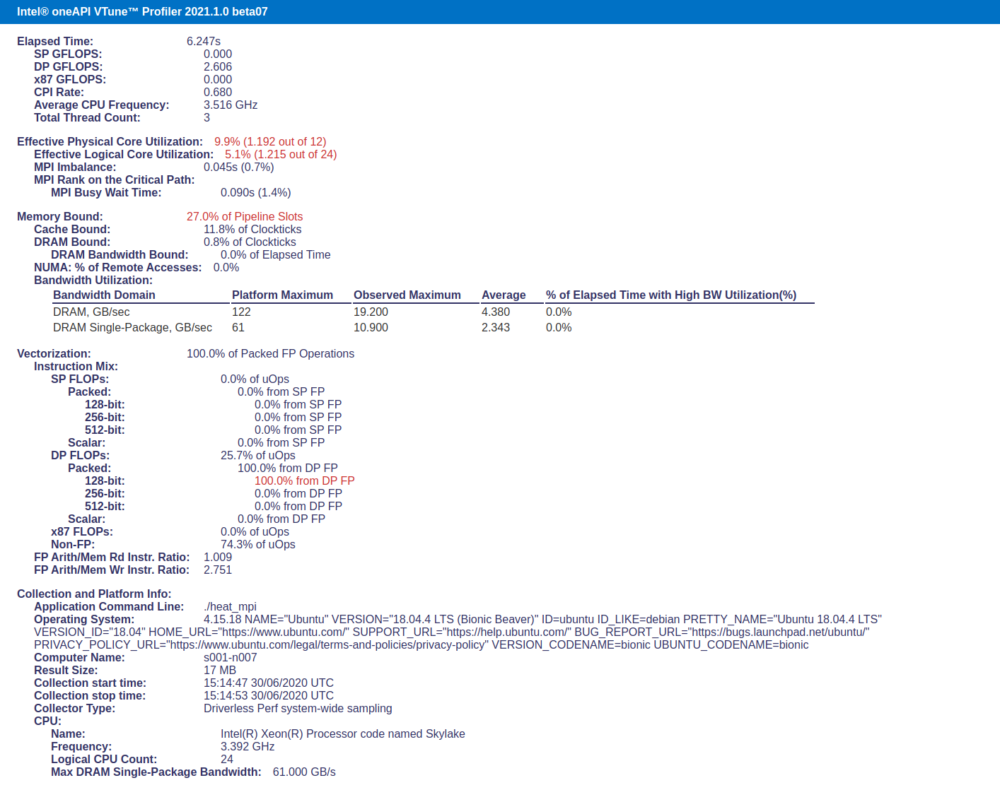
